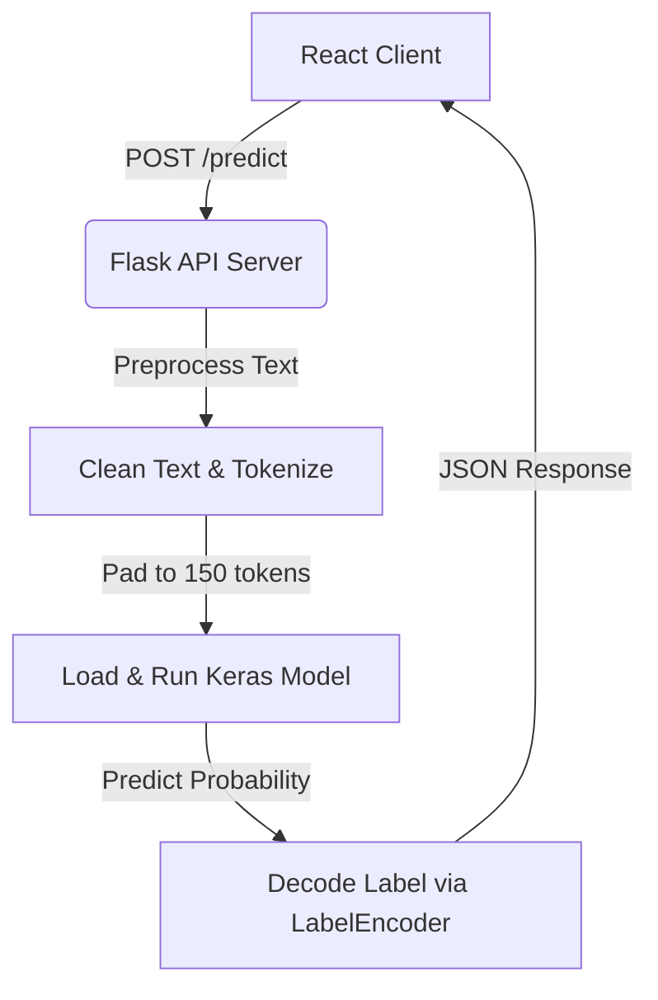

# 📧 Phishing Email Detection System

An end-to-end, deep-learning-powered web application designed to detect phishing and malicious emails. This project integrates a **TensorFlow/Keras Deep Learning model** with a **Python Flask backend** and a modern, high-performance **React (Vite + Tailwind CSS)** frontend to deliver real-time email analysis.

---

## 🌟 Features

- **Real-Time Classification:** Instantly classifies entered email content into **Safe Email** or **Phishing Email**.
- **Deep Learning Core:** Uses a trained Keras Neural Network with specialized text preprocessing (URL removal, punctuation stripping, lowercasing, and custom padding).
- **Interactive UI/UX:** A stunning, modern React frontend built with Vite, Tailwind CSS v4, and Framer Motion for sleek micro-interactions and transitions.
- **Concurrent Startup:** Run both backend and frontend applications seamlessly with a single command launcher.

---

## 📐 Architecture & Tech Stack



### Backend
- **Framework:** Python Flask with Flask-CORS
- **ML/DL Framework:** TensorFlow & Keras
- **NLP / Preprocessing:** Regex-based cleaning, `pickle` (for pre-trained tokenizer and label encoder)
- **Port:** `5000`

### Frontend
- **Framework:** React 19 (Vite-powered)
- **Styling:** Tailwind CSS v4
- **Animations:** Framer Motion
- **Icons:** React Icons
- **HTTP Client:** Axios
- **Port:** `5173` (Vite dev server)

---

## 📂 Project Structure

```text
Phishing_Ditection_Project/
├── Main.py              # Startup script that launches both Backend and Frontend concurrently
├── README.md            # Project documentation
├── Execution.txt        # Contains execution commands for reference
│
├── backend/             # Flask API server & ML model
│   ├── Api.py           # Flask server with text preprocessing & Keras model inference
│   ├── model.keras      # Saved TensorFlow/Keras neural network model (~110 MB)
│   ├── tokenizer.pkl    # Pre-trained Keras Tokenizer artifact
│   ├── label_encoder.pkl# Pre-trained scikit-learn LabelEncoder artifact
│   ├── requirements.txt # Python dependencies
│   ├── Phishing_Email.csv                              # Dataset (~175K email samples)
│   └── phishing-email-detection-using-deep-learning.ipynb  # Model training notebook
│
└── frontend/            # Vite + React single-page application
    ├── src/
    │   ├── components/  # Navbar, Hero, Features, EmailAnalyzer, ResultCard, Footer, Loader
    │   ├── pages/       # LandingPage, AnalyzePage, FeaturesPage, AboutPage
    │   ├── services/    # Axios API client configured for the backend
    │   ├── hooks/       # Custom React hooks
    │   ├── index.css    # Global Tailwind styles
    │   └── main.jsx     # Frontend entry point
    ├── .env             # Environment variables (VITE_API_BASE_URL)
    ├── vite.config.js   # Vite configuration
    └── package.json     # Node package scripts and dependencies
```

---

## 🚀 Getting Started

### Prerequisites
Make sure you have the following installed on your machine:
- **Python 3.9 - 3.11** (TensorFlow compatibility)
- **Node.js** (v18 or higher)
- **npm** (Node Package Manager)

### Step 1: Backend Setup
1. Navigate to the `backend` directory:
   ```bash
   cd backend
   ```
2. Install the required Python packages:
   ```bash
   pip install -r requirements.txt
   ```
   *(Note: The model was trained using TensorFlow/Keras. Make sure to match versions if compatibility errors arise).*

### Step 2: Frontend Setup
1. Navigate to the `frontend` directory:
   ```bash
   cd frontend
   ```
2. Install dependencies:
   ```bash
   npm install
   ```

---

## 🖥️ Running the Application

### Method A: Single Command (Recommended)
You can start both the backend API and the React frontend concurrently using the provided launcher:
```bash
python Main.py
```
This script will:
1. Open a new console running `python Api.py` inside the `backend/` folder (Flask API on port 5000).
2. Sleep for 5 seconds to allow the backend to spin up.
3. Open another console running `npm run dev` inside the `frontend/` folder.

### Method B: Manual Startup
If you prefer to run them manually, open two separate terminal sessions:

#### Terminal 1: Backend
```bash
cd backend
python Api.py
```

#### Terminal 2: Frontend
```bash
cd frontend
npm run dev
```

Once running, navigate to `http://localhost:5173` in your browser.

---

## 🔌 API Reference

### Predict Phishing Class

* **URL:** `/predict`
* **Method:** `POST`
* **Content-Type:** `application/json`
* **Request Body:**
  ```json
  {
    "email": "Dear user, your bank account has been locked. Click here http://scam-url.com to login."
  }
  ```

* **Response (Success - 200 OK):**
  ```json
  {
    "prediction": "Phishing Email"
  }
  ```
  *(Alternative value: `"Safe Email"`)*

* **Response (Error - 400 Bad Request):**
  ```json
  {
    "error": "Provide email field"
  }
  ```

---

## 🧠 Model Training & Preprocessing
The model training workflow is documented inside `phishing-email-detection-using-deep-learning.ipynb`. 
1. **Cleaning:** Strips URLs, punctuation, converts text to lowercase, and trims whitespaces.
2. **Tokenization:** Converts cleaned string tokens to sequences of integers mapping to the training corpus vocabulary.
3. **Padding:** Sequence length is capped/padded to a fixed size of `150` elements.
4. **Classification Neural Network:** A deep learning model trained on over 170,000 samples from the `Phishing_Email.csv` dataset, outputting classification probabilities mapped to either `Safe Email` or `Phishing Email`.

---

## 🌐 Hosting / Deployment Guide

Since the project has **two separate services** (Flask backend + React frontend), the recommended approach is to host them independently and connect them via the API URL.

### Recommended Free Hosting Stack

| Component | Platform | Free Tier |
|-----------|----------|-----------|
| **Backend** (Flask + ML Model) | [Render](https://render.com) | ✅ Free Web Service (750 hrs/month) |
| **Frontend** (React) | [Vercel](https://vercel.com) | ✅ Free for personal projects |

---

### 🔧 Step 1 — Prepare the Backend for Deployment

#### 1.1 `requirements.txt`
A `requirements.txt` is already included in `backend/`. If you need to add more packages, edit `backend/requirements.txt`.
> `gunicorn` is a production WSGI server needed for deployment (replaces Flask's dev server).

#### 1.2 Create a `Procfile` (for Render / Heroku)
In the `backend/` folder, create a file named `Procfile` (no extension):
```text
web: gunicorn Api:app --bind 0.0.0.0:$PORT
```

#### 1.3 Create a `.gitignore` for the backend
```text
__pycache__/
*.pyc
Phishing_Email.csv
.env
```
> **Note:** The CSV dataset (~52 MB) is **not needed** at runtime — only the model and pickle files are required. Exclude it to keep the repo small.

#### 1.4 Push to GitHub
Initialize a Git repo inside the `backend/` folder and push to GitHub:
```bash
cd backend
git init
git add Api.py model.keras tokenizer.pkl label_encoder.pkl requirements.txt Procfile .gitignore
git commit -m "Initial backend deployment"
git remote add origin https://github.com/YOUR_USERNAME/phishing-detection-api.git
git push -u origin main
```
> ⚠️ **Important:** `model.keras` is ~110 MB. You will need [Git LFS](https://git-lfs.github.com/) to push it:
> ```bash
> git lfs install
> git lfs track "*.keras"
> git add .gitattributes
> ```

---

### 🚀 Step 2 — Deploy the Backend on Render (Free)

1. Go to [render.com](https://render.com) and sign up / log in.
2. Click **"New +"** → **"Web Service"**.
3. Connect your GitHub repository containing the backend.
4. Configure the service:
   | Setting | Value |
   |---------|-------|
   | **Name** | `phishing-detection-api` |
   | **Region** | Choose the nearest region |
   | **Runtime** | `Python 3` |
   | **Build Command** | `pip install -r requirements.txt` |
   | **Start Command** | `gunicorn Api:app --bind 0.0.0.0:$PORT` |
   | **Instance Type** | `Free` |
5. Click **"Create Web Service"** and wait for the build to complete.
6. Render will give you a live URL like:
   ```
   https://phishing-detection-api.onrender.com
   ```
7. Test it by visiting `https://phishing-detection-api.onrender.com/` — you should see *"Phishing Email Detection API Running"*.

> 💡 **Tip:** The free tier spins down after 15 minutes of inactivity. The first request after a cold start takes ~30-60 seconds.

---

### 🎨 Step 3 — Deploy the Frontend on Vercel (Free)

#### 3.1 Update the API URL
Before deploying, you need to point the frontend to your live backend URL instead of `localhost:5000`.

Update the `frontend/.env` file:
```env
VITE_API_BASE_URL=https://phishing-detection-api.onrender.com
```

Or, you can set this as an **Environment Variable** in the Vercel dashboard (recommended).

#### 3.2 Push the Frontend to GitHub
Push the `frontend/` folder as its own repository (or as a subdirectory — Vercel handles both):
```bash
cd frontend
git init
git add .
git commit -m "Initial frontend deployment"
git remote add origin https://github.com/YOUR_USERNAME/phishing-detection-frontend.git
git push -u origin main
```

#### 3.3 Deploy on Vercel
1. Go to [vercel.com](https://vercel.com) and sign up / log in with GitHub.
2. Click **"Add New Project"** → Import your frontend repository.
3. Vercel auto-detects Vite. Configure:
   | Setting | Value |
   |---------|-------|
   | **Framework Preset** | `Vite` |
   | **Build Command** | `npm run build` |
   | **Output Directory** | `dist` |
4. Add the **Environment Variable**:
   - Key: `VITE_API_BASE_URL`
   - Value: `https://phishing-detection-api.onrender.com`
5. Click **"Deploy"**.
6. Your frontend will be live at something like:
   ```
   https://phishing-detection.vercel.app
   ```

---

### 🔀 Alternative Hosting Platforms

#### Backend Alternatives
| Platform | Notes |
|----------|-------|
| [Railway](https://railway.app) | Free tier with $5 credit/month, very easy setup |
| [Google Cloud Run](https://cloud.google.com/run) | Generous free tier, scales to zero, requires Dockerfile |
| [AWS EC2](https://aws.amazon.com/ec2/) | 12-month free tier (t2.micro), full server control |
| [PythonAnywhere](https://www.pythonanywhere.com) | Free tier for small Flask apps (limited CPU for TensorFlow) |

#### Frontend Alternatives
| Platform | Notes |
|----------|-------|
| [Netlify](https://netlify.com) | Similar to Vercel, free tier, auto-deploys from Git |
| [GitHub Pages](https://pages.github.com) | Free static hosting (needs `HashRouter` instead of `BrowserRouter`) |
| [Cloudflare Pages](https://pages.cloudflare.com) | Unlimited bandwidth on free tier |

#### All-in-One (Both on Same Server)
If you prefer hosting everything on one machine:
| Platform | Notes |
|----------|-------|
| [AWS EC2](https://aws.amazon.com/ec2/) / [Google Cloud VM](https://cloud.google.com/compute) | Run both services on a single VM, use Nginx as reverse proxy |
| [Railway](https://railway.app) | Deploy both as separate services in one project |

---

### 🐳 Docker Deployment (Advanced)

For a containerized deployment, create a `Dockerfile` in the project root:

```dockerfile
FROM python:3.11-slim

WORKDIR /app

COPY requirements.txt .
RUN pip install --no-cache-dir -r requirements.txt

COPY Api.py model.keras tokenizer.pkl label_encoder.pkl ./

EXPOSE 5000

CMD ["gunicorn", "Api:app", "--bind", "0.0.0.0:5000"]
```

Build and run:
```bash
docker build -t phishing-api .
docker run -p 5000:5000 phishing-api
```

This Docker image can be deployed to **Google Cloud Run**, **AWS ECS**, **Azure Container Apps**, or any platform that supports Docker.
